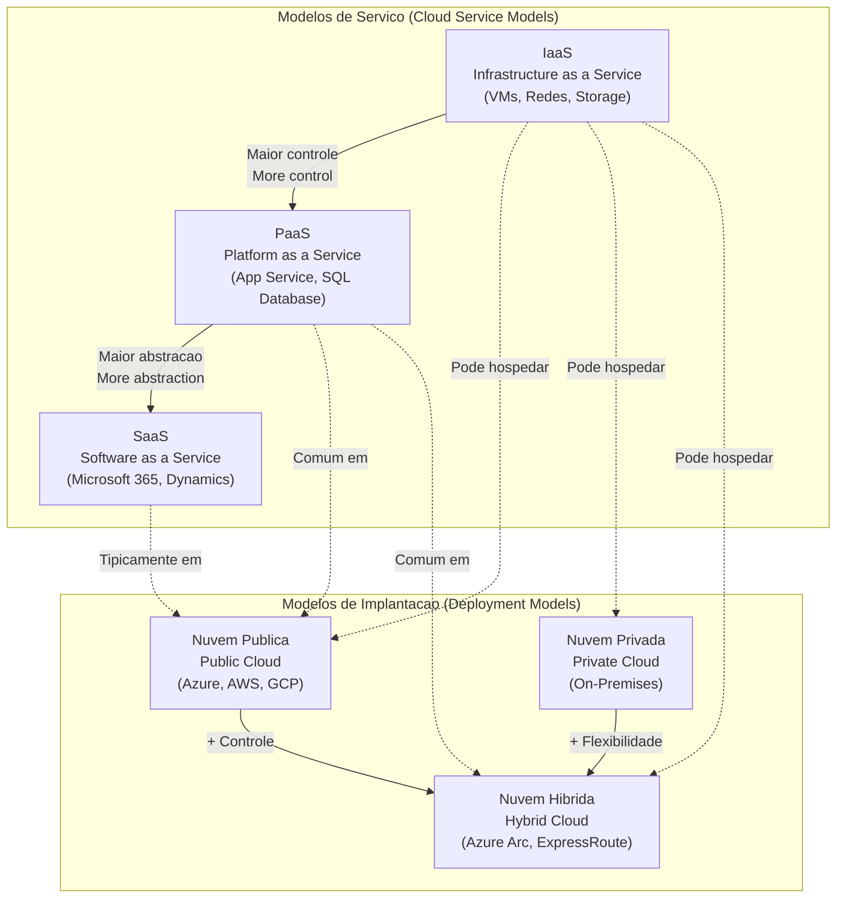

# 50 Anos de Computação em Nuvem com Azure

---

## PT-BR | Português

Este repositório contém anotações, insights e práticas desenvolvidas durante o curso **"50 Anos de Computação em Nuvem com Azure"**, promovido pela Microsoft em comemoração aos 50 anos da computação no Brasil, em parceria com a DIO.

### Sobre o curso

O curso realiza uma jornada pela evolução da computação até os dias atuais, com foco especial no uso da nuvem e no ecossistema do Microsoft Azure. Ele combina história, fundamentos, ferramentas modernas e aplicação prática — tudo pensado para quem deseja entender como a computação em nuvem vem transformando o mundo dos negócios, da tecnologia e da inovação.

---

### Arquitetura de Serviços e Modelos de Implantação

O diagrama abaixo representa os modelos de serviço e os modelos de implantação em nuvem, conforme abordados no curso:

---

### Temas abordados

#### Conceitos de Computacao em Nuvem

- O que e computacao em nuvem?
- Modelos de servico: IaaS, PaaS, SaaS
- Modelos de implantacao: Nuvem publica, privada e hibrida
- Vantagens da nuvem: escalabilidade, elasticidade, economia de custos, seguranca e alta disponibilidade

#### Introducao ao Microsoft Azure

- Visao geral do portal Azure
- Recursos principais: maquinas virtuais, bancos de dados, redes, containers
- Azure Marketplace e Azure Resource Manager (ARM)

#### Seguranca e Conformidade na Nuvem

- Principios de seguranca na nuvem
- Gerenciamento de identidade e acesso (IAM)
- Microsoft Entra ID (antigo Azure Active Directory)
- Certificacoes e conformidades do Azure

#### Praticas e Demonstracoes

- Criando uma maquina virtual no Azure
- Implantando uma aplicacao web com Azure App Service
- Monitoramento com Azure Monitor
- Automacao de processos com Azure Logic Apps

---

### O que aprendi

- Entender como a nuvem mudou a forma de entregar e consumir tecnologia
- Usar os servicos essenciais do Azure para construir solucoes modernas
- Criar, configurar e escalar recursos de forma pratica
- Compreender como seguranca, identidade e governanca sao tratadas na nuvem
- Explorar oportunidades de carreira na area de cloud computing

---

### Recomendacoes

Para quem deseja iniciar ou aprofundar conhecimentos em nuvem com uma abordagem pratica e conteudo de qualidade, este curso da Microsoft e um excelente ponto de partida. A combinacao entre historia da computacao e tecnologia atual torna o aprendizado mais contextualizado e significativo.

---

## EN | English

This repository contains notes, insights, and hands-on practices developed during the course **"50 Years of Cloud Computing with Azure"**, promoted by Microsoft to celebrate 50 years of computing in Brazil, in partnership with DIO.

### About the Course

The course takes a journey through the evolution of computing up to the present day, with a special focus on cloud computing and the Microsoft Azure ecosystem. It combines history, fundamentals, modern tools, and practical application — all designed for those who want to understand how cloud computing is transforming the business, technology, and innovation landscape.

---

### Topics Covered

#### Cloud Computing Concepts

- What is cloud computing?
- Service models: IaaS, PaaS, SaaS
- Deployment models: Public, Private, and Hybrid Cloud
- Cloud advantages: scalability, elasticity, cost savings, security, and high availability

#### Introduction to Microsoft Azure

- Overview of the Azure portal
- Core resources: virtual machines, databases, networks, containers
- Azure Marketplace and Azure Resource Manager (ARM)

#### Security and Compliance in the Cloud

- Cloud security principles
- Identity and Access Management (IAM)
- Microsoft Entra ID (formerly Azure Active Directory)
- Azure certifications and compliance frameworks

#### Hands-on Practices and Demonstrations

- Creating a virtual machine on Azure
- Deploying a web application with Azure App Service
- Monitoring with Azure Monitor
- Process automation with Azure Logic Apps

---

### Key Takeaways

- Understanding how the cloud changed the way technology is delivered and consumed
- Using Azure's essential services to build modern solutions
- Creating, configuring, and scaling resources in a practical way
- Understanding how security, identity, and governance are handled in the cloud
- Exploring career opportunities in the cloud computing field

---

### Recommendations

For anyone looking to start or strengthen their knowledge of cloud computing with a practical and high-quality approach, this Microsoft course is an excellent starting point. The combination of computing history and current technology makes the learning experience more contextualized and meaningful.

---

## License

This project is licensed under the [MIT License](https://opensource.org/licenses/MIT).

---

## Author

**Gabriel Demetrios Lafis**
Curitiba, Brasil
[github.com/galafis](https://github.com/galafis)
